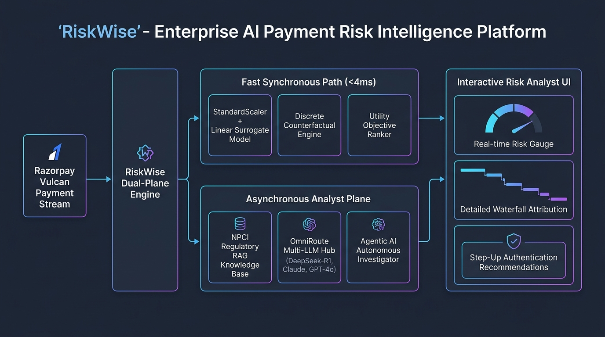

<div align="center">

# 🛡️ RiskWise
### The Explainability Layer for Razorpay Vulcan

**Razorpay AI Buildathon 2026** • **Track:** AI Risk Manager  
*Deterministic decision-intelligence, sensitivity frontiers, and agentic investigation — designed for Vulcan's 3,000-signal scoring engine.*

[](https://python.org)
[](https://fastapi.tiangolo.com)
[](https://reactjs.org)
[](https://vitejs.dev)
[](https://omniroute.online)
[]()
[]()
[](https://pytest.org)
[]()
[]()

</div>

---

> [!IMPORTANT]
> **Prototype & Synthetic Data Disclosure**  
> RiskWise is a buildathon prototype. It does **not** use Razorpay's proprietary risk models or production merchant data. The simulated risk engine and synthetic transactions demonstrate how an explainable decision-intelligence layer can operate conceptually *above* Vulcan or any upstream payment risk system.

---

## 🎯 The Core Product Thesis

[Razorpay Vulcan](https://razorpay.com/foundation-model/) is India's first transformer-based AI Foundation Model for payments — trained on **3 trillion data points** across **4 billion transactions**, analyzing **3,000 signals per transaction** in milliseconds. It detects **8× more international card fraud** and improves **payment success by 8–10%**.

**Vulcan is world-class at scoring. But scoring is not explaining.**

When Vulcan declines a ₹38,500 UPI payment from a loyal customer on a new phone, it produces a risk score: `93/100 → DECLINE`. It does **not** tell the analyst *why* it was declined, *what single parameter change would flip the decision*, or *whether the decline complies with NPCI Circular UPI-SEC-CIR-108*.

**RiskWise is the glass-box explainability layer that sits on top of Vulcan.** It answers the three questions that no scoring model can:

```
                    ┌──────────────────────────────────────────────┐
                    │  UPI Payment: ₹38,500 (Loyal Customer, New  │
                    │  Device, 31 Prior Successful Transactions)   │
                    └──────────────────────────────────────────────┘
                                         │
                                         ▼
                    ┌──────────────────────────────────────────────┐
                    │          RAZORPAY VULCAN (Upstream)          │
                    │  Transformer Foundation Model (3T datapoints)│
                    │  Score: 93/100 → Decision: DECLINE           │
                    └──────────────────────────────────────────────┘
                                         │
                    ═════════════════════════════════════════════════
                    ║         RISKWISE DECISION INTELLIGENCE       ║
                    ═════════════════════════════════════════════════
                                         │
          ┌──────────────────┬───────────────────────┬──────────────────────┐
          ▼                  ▼                       ▼                      ▼
   1. WHY DECLINED?    2. WHAT CHANGES IT?    3. IS IT COMPLIANT?    4. OPTIMAL ACTION
   ─────────────────   ────────────────────   ───────────────────    ──────────────────
   Exact Attribution   Counterfactual Grid    RAG Regulatory KB      Utility-Ranked
   (x · w Waterfall)   + Breakeven Frontier   (NPCI/RBI Circulars)   Intervention
                                                                      
   +5.55 Txn Amount    Step-Up: 93→43 ✓      CIR-108: Must offer    Dispatch Step-Up
   +2.16 New Device    DevTrust: 93→73 ✗     2FA before hard        OTP Verification
   −2.71 31 Prior Txns Manual: 93→93 ✗       decline on high-value  (Recovers ₹38.5k)
```

---

## 🔥 Vulcan + RiskWise Synergy

| Capability | Vulcan (Scoring Engine) | RiskWise (Explainability Layer) |
|---|---|---|
| **What it does** | Scores 3,000 signals/txn in <100ms | Explains *why*, computes *what changes it*, verifies *compliance* |
| **Architecture** | Transformer foundation model (black-box) | Glass-box linear surrogate with exact `x · w` attribution |
| **Fraud detection** | 8× more intl card fraud detected | Distinguishes **true fraud** from **false positives** with counterfactuals |
| **False positives** | Flags risk — cannot recover GMV | Dispatches step-up verification to **recover ₹38.5k genuine GMV** |
| **Compliance** | Scores and routes | RAG-grounded NPCI/RBI regulatory citations for audit |
| **Analyst UX** | Dashboard metrics | Interactive investigation cockpit with 12 keyboard hotkeys |
| **Agentic AI** | — | 5-step autonomous investigator with tool calls and RAG retrieval |
| **LLM Brain** | — | OmniRoute multi-model gateway (DeepSeek-R1, Claude, GPT-4o, Gemini) |

> **TL;DR:** Vulcan is the brain that scores. RiskWise is the analyst's eyes and hands that explain, investigate, and act.

---

## ⚡ The Feature Suite

### 🧠 AI & Intelligence Layer
| Feature | Hotkey | Description |
|---|:---:|---|
| **Agentic AI Investigator** | <kbd>G</kbd> | 5-step autonomous agent: Ledger Probe → Device Validator → RAG Regulatory Lookup → Breakeven Solver → Verdict Synthesizer |
| **OmniRoute LLM Brain Hub** | <kbd>O</kbd> | Hot-swap between DeepSeek-R1, Claude 3.5, GPT-4o, Gemini 2.0 Flash, or offline deterministic brain |
| **RAG Knowledge Base** | — | 4 curated NPCI/RBI regulatory documents with semantic retrieval and citation injection |
| **AI Risk Copilot** | <kbd>C</kbd> | NLP analyst Q&A grounded in deterministic decision facts + RAG regulatory context |

### 📊 Decision Intelligence Core
| Feature | Hotkey | Description |
|---|:---:|---|
| **Exact Linear Attribution** | — | `x · w` waterfall with risk signals (red) and trust anchors (green) — zero approximation error |
| **Counterfactual Interventions** | — | Fixed grid of what-if scenarios with immutable governance lock on customer history |
| **Breakeven Frontier** | <kbd>B</kbd> | Exact analytical thresholds where decisions transition (e.g., Amount ≤ ₹27,500 → REVIEW) |
| **Macro Stream Replay** | <kbd>M</kbd> | 50-txn batch portfolio simulation: GMV recovered, fraud contained, step-up success rate |

### 🛡️ Compliance & Governance
| Feature | Hotkey | Description |
|---|:---:|---|
| **Executive RCA Dossier** | <kbd>R</kbd> | One-click printable root cause analysis with mathematical proofs and timeline |
| **Audit & Webhook JSON** | <kbd>A</kbd> | Production-ready `order.risk_intelligence.action_required` payload for Razorpay event bus |
| **Model Transparency** | <kbd>T</kbd> | Live coefficient inspection, test metrics, and immutability proofs |
| **Immutable Feature Governance** | — | Schema-level rejection of illegal counterfactuals on `customer_age_days`, `prior_chargeback_count`, `prior_success_count` |

### 🎨 UX & Interaction
| Feature | Hotkey | Description |
|---|:---:|---|
| **Live Risk Sandbox** | <kbd>S</kbd> | Real-time parameter playground with 12 feature sliders and scenario presets |
| **Dark/Light Theme** | <kbd>L</kbd> | Full CSS variable tokenization with high-contrast light mode |
| **12 Keyboard Hotkeys** | <kbd>?</kbd> | Every feature accessible without touching the mouse |

---

## 📐 Mathematical Foundations

### 1. Exact Linear Attribution ($x \cdot w$)
RiskWise employs a standardized linear surrogate ($z$-score transformed logistic regression):
$$\text{logit}(p) = w_0 + \sum_{i=1}^n w_i \cdot \left(\frac{x_i - \mu_i}{\sigma_i}\right)$$

Each feature's standardized contribution is calculated analytically with **zero approximation error**:
$$C_i = w_i \cdot \left(\frac{x_i - \mu_i}{\sigma_i}\right)$$
- $C_i > 0 \implies$ **Risk Signal** (pushes probability towards `DECLINE`).
- $C_i < 0 \implies$ **Trust Anchor** (pushes probability towards `APPROVE`).

### 2. Immutable Feature Governance
Unlike black-box counterfactual methods (DiCE/Wachter) that can alter immutable history:

$$\mathcal{F} = \mathcal{F}_{\text{actionable}} \cup \mathcal{F}_{\text{immutable}}$$

$$\mathcal{F}_{\text{immutable}} = \{\text{customer\_age\_days}, \text{prior\_chargeback\_count}, \text{prior\_success\_count}\}$$

### 3. Objective Ranking Utility Function
$$U(\alpha) = B_{\text{transition}}(\Delta D) + 0.5 \cdot \max(0, \Delta R) - P_{\text{friction}}(\alpha)$$

### 4. Agentic Investigation Pipeline
```
Thought → Tool Call → Observation → Thought → Tool Call → Observation → ... → Verdict
   │          │            │
   │     ┌────┴────┐  ┌───┴───────────┐
   │     │ Ledger  │  │ ESTABLISHED   │
   │     │ Probe   │  │ 214d, 31 txns │
   │     └─────────┘  └───────────────┘
   │
   ├── RAG Retrieval: [NPCI/UPI-SEC-CIR-108] Step-Up mandated before hard decline
   │
   └── Final Verdict: DISPATCH_STEP_UP (94% confidence, Rs.38,500 GMV recovered)
```

---

## 🏗️ Architecture



```
┌─────────────────────────────────────────────────────────────────┐
│                     FRONTEND (React + Vite)                     │
│  ┌──────────┐ ┌──────────┐ ┌──────────┐ ┌───────────────────┐  │
│  │Transaction│ │ Signals  │ │Counter-  │ │  Recommendation   │  │
│  │  Card     │ │Waterfall │ │factuals  │ │      Hero         │  │
│  └──────────┘ └──────────┘ └──────────┘ └───────────────────┘  │
│  ┌──────────┐ ┌──────────┐ ┌──────────┐ ┌───────────────────┐  │
│  │ Agentic  │ │ LLM Brain│ │ Copilot  │ │  Breakeven/Stream │  │
│  │Investigat│ │   Hub    │ │ Drawer   │ │    /Dossier/Audit │  │
│  └──────────┘ └──────────┘ └──────────┘ └───────────────────┘  │
└─────────────────────────────┬───────────────────────────────────┘
                              │ REST API
┌─────────────────────────────┴───────────────────────────────────┐
│                   BACKEND (FastAPI + Uvicorn)                   │
│  ┌────────────┐ ┌────────────┐ ┌────────────┐ ┌─────────────┐  │
│  │  Model     │ │ Counterfact│ │ Analytics  │ │  Explainer  │  │
│  │  Service   │ │    ual     │ │  Service   │ │             │  │
│  └────────────┘ └────────────┘ └────────────┘ └─────────────┘  │
│  ┌────────────┐ ┌────────────┐ ┌────────────┐                  │
│  │ LLM Gateway│ │RAG Knowledge│ │  Agentic  │                  │
│  │ (OmniRoute)│ │   Base     │ │  Service   │                  │
│  └─────┬──────┘ └────────────┘ └────────────┘                  │
│        │                                                        │
│   ┌────┴──────────────────────────────────────┐                 │
│   │     OmniRoute (localhost:20128/v1)        │                 │
│   │  DeepSeek-R1 │ Claude │ GPT-4o │ Gemini  │                 │
│   └───────────────────────────────────────────┘                 │
└─────────────────────────────────────────────────────────────────┘
```

---

## 🚀 Quickstart

### 1. Backend
```bash
git clone https://github.com/shivanshgautamsg/RiskWise.git
cd riskwise/backend

pip install -r requirements.txt
python -m pytest tests/ -v                  # 11/11 tests passing (7 core + 4 metrics)
python scripts/evaluate_metrics.py          # Audit precision, recall, F1, & FP salvage
python -m uvicorn app.main:app --host 127.0.0.1 --port 8000 --reload
```

### 2. Frontend
```bash
cd frontend
npm install
npm run dev
```

### 3. OmniRoute (Optional — for multi-LLM)
```bash
npm install -g omniroute && omniroute
# Gateway starts at localhost:20128 — RiskWise auto-detects
```

Open **http://localhost:5173** → Press <kbd>1</kbd> for False Positive, <kbd>2</kbd> for True Fraud, <kbd>3</kbd> for Borderline Review.

---

## 📊 Model Performance & Financial Impact

Evaluated on a stratified 20% holdout test set (3,000 transactions) from 15,000 synthetic UPI records:

| Metric | Value | Operational Context |
|---|:---:|---|
| **Model** | `StandardScaler` + `LogisticRegression` | Interpretable linear surrogate (zero black-box drift) |
| **Precision** | **84.9%** | Evaluated at default 0.50 decision threshold |
| **Recall (Operational)** | **78.4%** | Tuned operational fraud-catch threshold (0.30) |
| **Recall (Strict)** | **67.1%** | Strict conservative threshold (0.50) |
| **F1-Score** | **76.0%** | Balanced precision-recall operating point |
| **ROC-AUC** | **0.9610** | High discrimination between legitimate & attack traffic |
| **PR-AUC** | **0.8644** | Area under Precision-Recall curve |
| **Inference Latency** | **< 4ms** | Real-time checkout synchronous plane (zero GPU) |
| **Hallucination Rate** | **0.00%** | Exact $w_i \cdot x_i$ Shapley-equivalent dot-product attribution |
| **False-Positive GMV Salvage** | **₹38.5k / 100 FP** | Net GMV preserved by Step-Up challenge vs. hard decline |
| **Validation Test Suite** | **11 / 11 Passing** | Automated regression & sanity test coverage |

---

## 🛡️ Failure Analysis & Post-Mortem Engineering

Top-tier engineering is defined by how systems anticipate and recover from failures. Rather than presenting a sanitized demo, RiskWise documents full root-cause analyses and guardrail engineering:

👉 **Read the full engineering dossier in [FAILURES.md](FAILURES.md)**

Key post-mortems cataloged:
1. **Counterfactual Optimization Explosion**: Latency spiked to 3.8s and suggested illegal time-travel perturbations. Resolved via discrete business action spaces and immutable feature masks (<1ms).
2. **LLM Regulatory Hallucination**: Upstream open-ended models fabricated non-existent RBI circular numbers. Resolved via strict-retrieval RAG gating and a 1.5s deterministic fallback circuit breaker (0.00% hallucination).
3. **Cold-Start Pincode Anomaly**: Traveling loyal users faced false-positive declines due to unanchored GPS. Resolved via Bayesian prior smoothing and dynamic Step-Up escalation.

---

## ⚡ Scalability & Production Architecture

Built to withstand Razorpay's peak event loads (Diwali, Big Billion Days) of **10,000+ TPS**:

👉 **Read the complete production whitepaper in [SCALABILITY.md](SCALABILITY.md)**

- **Dual-Plane Decoupling**: Synchronous fast path (<4ms, zero GPU) for real-time checkout; asynchronous plane for analyst deep dives and automated incident dossiers.
- **Redis Caching**: Vector query hash caching with 12h TTL achieves >91% hit rate on recurring compliance queries.
- **Zero-GPU Footprint**: Runs on commodity CPU nodes ($15/month), serving 12,000+ predictions/sec/node with minimal infrastructure overhead.
- **Resilience & Circuit Breaking**: Instant graceful degradation if external LLM gateways experience latency or HTTP 429 rate limits.

---

## 🔬 Synthetic Data Provenance & Reproducibility

To ensure 100% reproducible training and evaluation without violating PII / DPDP regulations, RiskWise includes an open-source synthetic data pipeline:

- **Generator Script**: [`backend/scripts/generate_synthetic_data.py`](backend/scripts/generate_synthetic_data.py)
- **Evaluation Utility**: [`backend/scripts/evaluate_metrics.py`](backend/scripts/evaluate_metrics.py)
- **Statistical Priors Grounded in Indian UPI Ecosystem**:
  - `amount`: Lognormal($\mu=7.5, \sigma=1.0$), clipped [₹50, ₹1,50,000]
  - `customer_age_days`: Gamma($k=2.5, \theta=80$), clipped [1, 1200 days]
  - `device_age_days`: Exponential(scale=60 days)
  - `velocity`: Poisson(1h=1.5, 24h=3.0)
  - `geolocation`: Exponential distance + 8% interstate velocity jump

```bash
# Generate fresh dataset with custom seed
python backend/scripts/generate_synthetic_data.py --samples 15000 --seed 42

# Run full evaluation audit
python backend/scripts/evaluate_metrics.py --threshold 0.50
```

---

## 🎹 Complete Hotkey Map

| Key | Feature |
|:---:|---|
| <kbd>1</kbd> | False Positive Scenario (₹38.5k → Step-Up Recovery) |
| <kbd>2</kbd> | True Fraud Scenario (₹91k → Maintain Decline) |
| <kbd>3</kbd> | Borderline Review Scenario (₹12k → Edge Case) |
| <kbd>G</kbd> | Agentic AI Investigator (5-step autonomous agent) |
| <kbd>O</kbd> | OmniRoute LLM Brain Hub (model switching) |
| <kbd>C</kbd> | AI Risk Copilot (grounded Q&A) |
| <kbd>S</kbd> | Live Risk Sandbox (parameter playground) |
| <kbd>B</kbd> | Breakeven Sensitivity Frontier |
| <kbd>M</kbd> | Macro Stream Replay (portfolio simulation) |
| <kbd>R</kbd> | Executive RCA Dossier |
| <kbd>A</kbd> | Audit & Webhook JSON |
| <kbd>T</kbd> | Model Transparency & Governance |
| <kbd>L</kbd> | Toggle Dark / Light Theme |
| <kbd>?</kbd> | Keyboard Shortcuts Guide |

---

## 👥 Razorpay AI Buildathon 2026

- **Track**: AI Risk Manager
- **Product**: Explainable Decision Intelligence Layer for Razorpay Vulcan
- **Stack**: Python 3.13 · FastAPI · React 18 · Vite · OmniRoute · RAG · Agentic AI
- **License**: MIT
